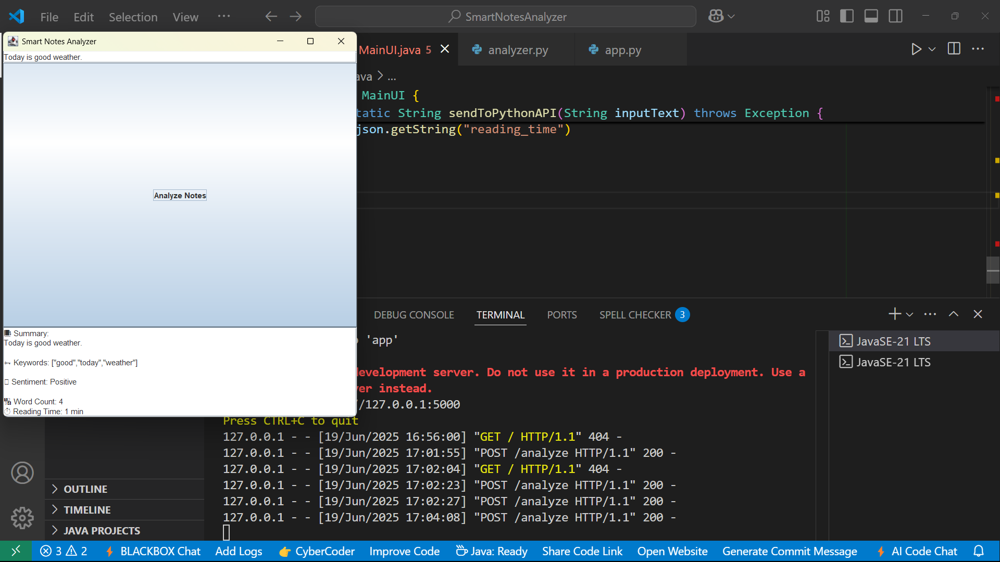
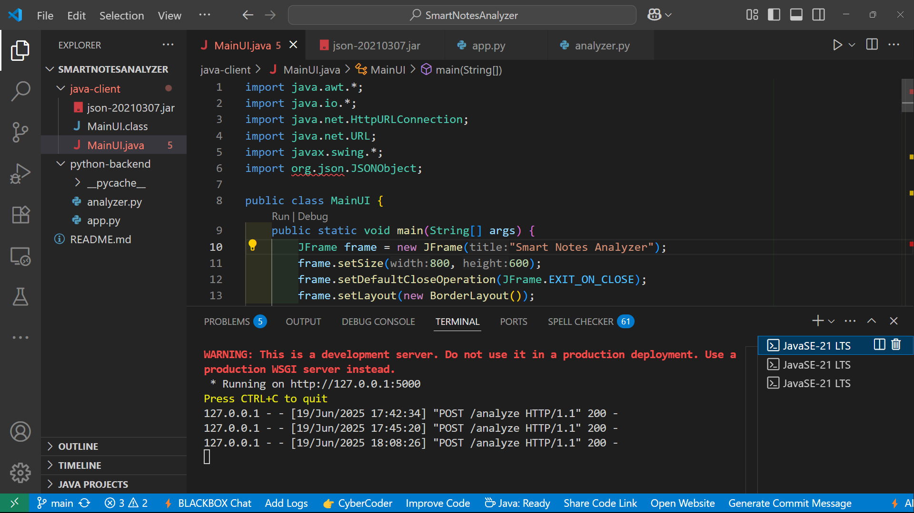
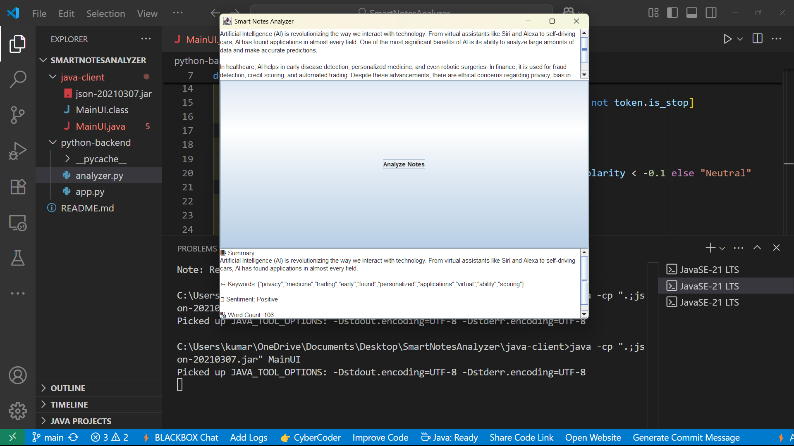

# 🧠 Smart Notes Analyzer

A hybrid Java + Python desktop application that uses Natural Language Processing (NLP) to analyze text notes and generate PDF summary reports.  

> 🚀 Built with Java Swing (frontend GUI) + Flask & spaCy/TextBlob (Python backend)
>
> ## 📁 Project Repository
[View the Project on GitHub](https://github.com/rohits78/SmartNotesAnalyzer)


## 📸 Screenshots

### 🧠 Java GUI - Input Note


### 📊 Analyzed Summary Output


### 🧾 Generated PDF Report



## ✨ Features

- 📄 Accepts custom notes input
- 🤖 Extracts:
  - Summary
  - Keywords
  - Sentiment (Positive/Negative/Neutral)
  - Word count
  - Estimated reading time
- 💡 Easy to extend with more NLP features

---

#1 🖥️ Tech Stack

| Layer       | Tech                              |
|-------------|-----------------------------------|
| Frontend    | Java Swing                        |
| Backend     | Python Flask                      |
| NLP         | spaCy, TextBlob                   |
| Communication | REST API (JSON) via `HttpURLConnection` |

---

## ⚙️ Setup Instructions

### 🔹 Python Backend

1. **Navigate to `python-backend` folder:**
```bash
cd python-backend
```
Install dependencies:

bash
Copy
Edit
pip install flask flask-cors textblob spacy fpdf
python -m spacy download en_core_web_sm
python -m textblob.download_corpora
Run Flask server:

bash
Copy
Edit
python app.py
Server will run at: http://localhost:5000/analyze

🔹 Java GUI Frontend
Navigate to java-client folder:

bash
Copy
Edit
cd java-client
Make sure json-20210307.jar is in the same folder

Download it from: https://repo1.maven.org/maven2/org/json/json/20210307/json-20210307.jar

Compile and run:

bash
Copy
Edit
javac -cp ".;json-20210307.jar" MainUI.java
java -cp ".;json-20210307.jar" MainUI

📂 Project Structure
Copy
Edit
SmartNotesAnalyzer/
├── java-client/
│   └── MainUI.java
├── python-backend/
│   ├── app.py
│   └── analyzer.py
└── README.md
📄 License
This project is open-source and free to use under the MIT License.

🙋‍♂️ Author
Made with ❤️ by Rohit Kumar
